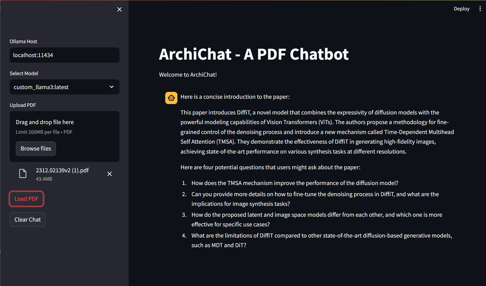

# ArchiChat

This is a small project to create a chat application using Ollama and streamlit. PDFs can be uploaded and the chatbot will answer questions about the content of the PDF. It requires setting up Ollama before running this app.

  

